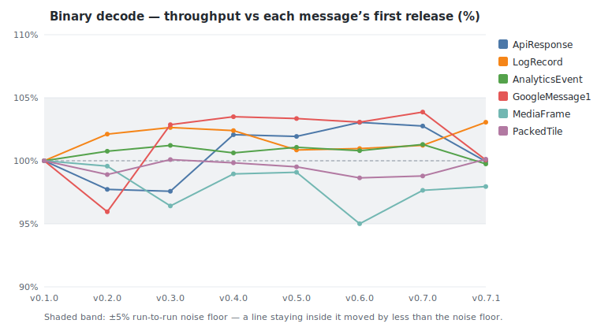
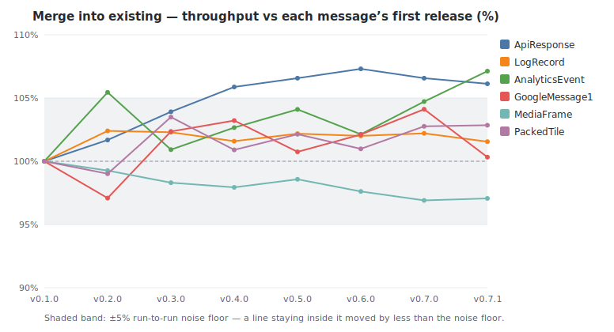
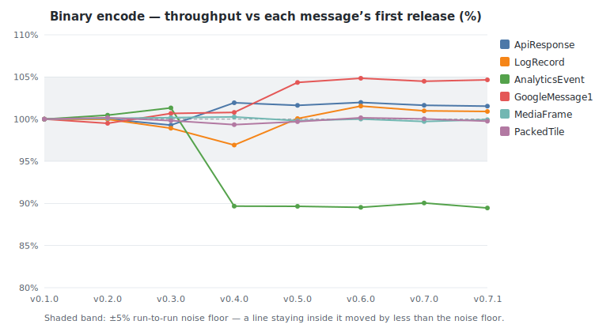
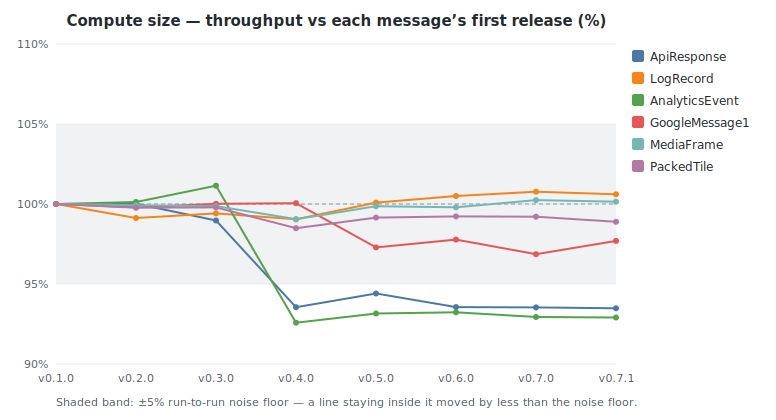
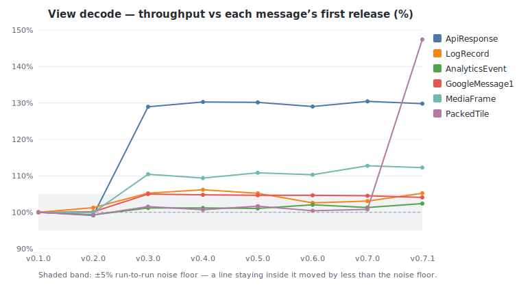
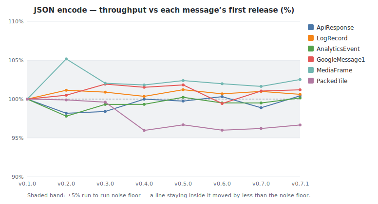
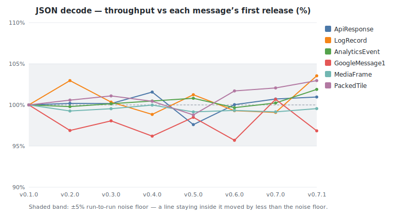

# buffa benchmark history

Throughput of buffa's own protobuf benchmarks across releases, measured on a
dedicated bare-metal box (turbo off, `performance` governor, per-core pinned).
Each release's source is built at one fixed toolchain and profile, held
constant across the series, so a delta reflects buffa's code rather than a
compiler or build-config change. The headline metric is **throughput in
MiB/s**, the median across cores, comparable across releases even when a tag's
dataset changed size. See [README.md](README.md) for methodology and caveats.

<!-- GENERATED by benchmarks/history/generate.py — do not edit by hand. -->

- Releases: v0.1.0, v0.2.0, v0.3.0, v0.4.0, v0.5.0, v0.6.0, v0.7.0, v0.7.1
- Machine: c7i.metal-24xl — Intel(R) Xeon(R) Platinum 8488C
- Tuning: turbo_disabled=1, governor=performance, pin_core=distinct-physical-per-instance
- Build profile: lto=true, codegen-units=1, per-message-isolated, 64-byte block-aligned (-align-all-nofallthru-blocks=6); measured 1-up (32-core self-concurrent)
- Samples: median of 32 cores per release (per-benchmark spread in run files)
- Criterion: 0.5.1 · latest measured at 2026-06-21T02:18:01Z

## Biggest movers (first tracked release → latest)

| Benchmark | First | Latest | Change | Range |
|-----------|------:|-------:|-------:|-------|
| PackedTile / decode_view | 175 | 257 | +47% | v0.1.0→v0.7.1 |
| ApiResponse / decode_view | 888 | 1,152 | +30% | v0.1.0→v0.7.1 |
| MediaFrame / decode_view | 45,228 | 50,769 | +12% | v0.1.0→v0.7.1 |
| AnalyticsEvent / merge | 144 | 154 | +7% | v0.1.0→v0.7.1 |
| ApiResponse / merge | 776 | 824 | +6% | v0.1.0→v0.7.1 |
| LogRecord / decode_view | 1,358 | 1,429 | +5% | v0.1.0→v0.7.1 |
| GoogleMessage1 / encode | 2,031 | 2,125 | +5% | v0.1.0→v0.7.1 |
| GoogleMessage1 / decode_view | 896 | 933 | +4% | v0.1.0→v0.7.1 |
| AnalyticsEvent / encode | 462 | 413 | −11% | v0.1.0→v0.7.1 |
| AnalyticsEvent / compute_size | 1,363 | 1,266 | −7% | v0.1.0→v0.7.1 |
| ApiResponse / compute_size | 8,026 | 7,502 | −7% | v0.1.0→v0.7.1 |
| PackedTile / json_encode | 386 | 373 | −3% | v0.1.0→v0.7.1 |
| GoogleMessage1 / json_decode | 418 | 405 | −3% | v0.1.0→v0.7.1 |
| MediaFrame / merge | 15,762 | 15,300 | −3% | v0.1.0→v0.7.1 |
| GoogleMessage1 / compute_size | 4,800 | 4,690 | −2% | v0.1.0→v0.7.1 |
| MediaFrame / decode | 12,200 | 11,951 | −2% | v0.1.0→v0.7.1 |

All throughput values are MiB/s; higher is better.

## Throughput by operation (MiB/s)

### Binary decode

| Message | v0.1.0 | v0.2.0 | v0.3.0 | v0.4.0 | v0.5.0 | v0.6.0 | v0.7.0 | v0.7.1 |
|---------|------:|------:|------:|------:|------:|------:|------:|------:|
| ApiResponse | 607 | 593 (−2%) | 592 (−0%) | 620 (+5%) | 619 (−0%) | 626 (+1%) | 624 (−0%) | 607 (−3%) |
| LogRecord | 510 | 520 (+2%) | 523 (+1%) | 522 (−0%) | 514 (−2%) | 515 (+0%) | 516 (+0%) | 525 (+2%) |
| AnalyticsEvent | 127 | 128 (+1%) | 129 (+0%) | 128 (−1%) | 129 (+0%) | 128 (−0%) | 129 (+0%) | 127 (−2%) |
| GoogleMessage1 | 605 | 581 (−4%) | 623 (+7%) | 627 (+1%) | 626 (−0%) | 624 (−0%) | 629 (+1%) | 606 (−4%) |
| MediaFrame | 12,200 | 12,148 (−0%) | 11,763 (−3%) | 12,072 (+3%) | 12,089 (+0%) | 11,591 (−4%) | 11,914 (+3%) | 11,951 (+0%) |
| PackedTile | 227 | 225 (−1%) | 227 (+1%) | 227 (−0%) | 226 (−0%) | 224 (−1%) | 224 (+0%) | 227 (+1%) |

### Merge into existing

| Message | v0.1.0 | v0.2.0 | v0.3.0 | v0.4.0 | v0.5.0 | v0.6.0 | v0.7.0 | v0.7.1 |
|---------|------:|------:|------:|------:|------:|------:|------:|------:|
| ApiResponse | 776 | 789 (+2%) | 807 (+2%) | 822 (+2%) | 827 (+1%) | 833 (+1%) | 827 (−1%) | 824 (−0%) |
| LogRecord | 747 | 765 (+2%) | 764 (−0%) | 759 (−1%) | 763 (+1%) | 762 (−0%) | 763 (+0%) | 759 (−1%) |
| AnalyticsEvent | 144 | 151 (+5%) | 145 (−4%) | 147 (+2%) | 149 (+1%) | 147 (−2%) | 150 (+3%) | 154 (+2%) |
| GoogleMessage1 | 885 | 859 (−3%) | 906 (+5%) | 914 (+1%) | 892 (−2%) | 904 (+1%) | 922 (+2%) | 888 (−4%) |
| MediaFrame | 15,762 | 15,646 (−1%) | 15,496 (−1%) | 15,437 (−0%) | 15,538 (+1%) | 15,386 (−1%) | 15,275 (−1%) | 15,300 (+0%) |
| PackedTile | 257 | 254 (−1%) | 266 (+5%) | 259 (−3%) | 262 (+1%) | 259 (−1%) | 264 (+2%) | 264 (+0%) |

### Binary encode

| Message | v0.1.0 | v0.2.0 | v0.3.0 | v0.4.0 | v0.5.0 | v0.6.0 | v0.7.0 | v0.7.1 |
|---------|------:|------:|------:|------:|------:|------:|------:|------:|
| ApiResponse | 1,943 | 1,943 (+0%) | 1,929 (−1%) | 1,980 (+3%) | 1,974 (−0%) | 1,981 (+0%) | 1,975 (−0%) | 1,973 (−0%) |
| LogRecord | 3,058 | 3,057 (−0%) | 3,025 (−1%) | 2,964 (−2%) | 3,060 (+3%) | 3,105 (+1%) | 3,088 (−1%) | 3,085 (−0%) |
| AnalyticsEvent | 462 | 464 (+0%) | 468 (+1%) | 414 (−11%) | 414 (−0%) | 414 (−0%) | 416 (+1%) | 413 (−1%) |
| GoogleMessage1 | 2,031 | 2,020 (−1%) | 2,044 (+1%) | 2,047 (+0%) | 2,119 (+4%) | 2,129 (+0%) | 2,122 (−0%) | 2,125 (+0%) |
| MediaFrame | 25,445 | 25,465 (+0%) | 25,490 (+0%) | 25,511 (+0%) | 25,395 (−0%) | 25,446 (+0%) | 25,373 (−0%) | 25,427 (+0%) |
| PackedTile | 482 | 482 (+0%) | 481 (−0%) | 478 (−0%) | 480 (+0%) | 482 (+0%) | 482 (−0%) | 480 (−0%) |

### Compute size

| Message | v0.1.0 | v0.2.0 | v0.3.0 | v0.4.0 | v0.5.0 | v0.6.0 | v0.7.0 | v0.7.1 |
|---------|------:|------:|------:|------:|------:|------:|------:|------:|
| ApiResponse | 8,026 | 8,027 (+0%) | 7,943 (−1%) | 7,508 (−5%) | 7,577 (+1%) | 7,508 (−1%) | 7,507 (−0%) | 7,502 (−0%) |
| LogRecord | 9,439 | 9,356 (−1%) | 9,383 (+0%) | 9,348 (−0%) | 9,447 (+1%) | 9,486 (+0%) | 9,511 (+0%) | 9,496 (−0%) |
| AnalyticsEvent | 1,363 | 1,365 (+0%) | 1,379 (+1%) | 1,262 (−8%) | 1,270 (+1%) | 1,271 (+0%) | 1,267 (−0%) | 1,266 (−0%) |
| GoogleMessage1 | 4,800 | 4,790 (−0%) | 4,801 (+0%) | 4,803 (+0%) | 4,670 (−3%) | 4,693 (+0%) | 4,650 (−1%) | 4,690 (+1%) |
| MediaFrame | 262,072 | 261,862 (−0%) | 261,729 (−0%) | 259,589 (−1%) | 261,709 (+1%) | 261,524 (−0%) | 262,707 (+0%) | 262,451 (−0%) |
| PackedTile | 1,489 | 1,486 (−0%) | 1,486 (+0%) | 1,467 (−1%) | 1,476 (+1%) | 1,477 (+0%) | 1,477 (−0%) | 1,472 (−0%) |

### View decode

| Message | v0.1.0 | v0.2.0 | v0.3.0 | v0.4.0 | v0.5.0 | v0.6.0 | v0.7.0 | v0.7.1 |
|---------|------:|------:|------:|------:|------:|------:|------:|------:|
| ApiResponse | 888 | 880 (−1%) | 1,145 (+30%) | 1,157 (+1%) | 1,156 (−0%) | 1,146 (−1%) | 1,158 (+1%) | 1,152 (−0%) |
| LogRecord | 1,358 | 1,376 (+1%) | 1,430 (+4%) | 1,442 (+1%) | 1,429 (−1%) | 1,393 (−2%) | 1,400 (+0%) | 1,429 (+2%) |
| AnalyticsEvent | 200 | 199 (−1%) | 203 (+2%) | 203 (+0%) | 202 (−0%) | 204 (+1%) | 203 (−1%) | 205 (+1%) |
| GoogleMessage1 | 896 | 898 (+0%) | 941 (+5%) | 939 (−0%) | 938 (−0%) | 938 (+0%) | 937 (−0%) | 933 (−0%) |
| MediaFrame | 45,228 | 45,181 (−0%) | 49,952 (+11%) | 49,475 (−1%) | 50,128 (+1%) | 49,891 (−0%) | 51,001 (+2%) | 50,769 (−0%) |
| PackedTile | 175 | 173 (−1%) | 177 (+2%) | 176 (−1%) | 177 (+1%) | 175 (−1%) | 176 (+0%) | 257 (+46%) |

### JSON encode

| Message | v0.1.0 | v0.2.0 | v0.3.0 | v0.4.0 | v0.5.0 | v0.6.0 | v0.7.0 | v0.7.1 |
|---------|------:|------:|------:|------:|------:|------:|------:|------:|
| ApiResponse | 584 | 573 (−2%) | 574 (+0%) | 584 (+2%) | 582 (−0%) | 586 (+1%) | 577 (−1%) | 586 (+2%) |
| LogRecord | 876 | 886 (+1%) | 883 (−0%) | 879 (−1%) | 886 (+1%) | 881 (−1%) | 884 (+0%) | 881 (−0%) |
| AnalyticsEvent | 548 | 536 (−2%) | 544 (+2%) | 544 (+0%) | 549 (+1%) | 545 (−1%) | 545 (−0%) | 548 (+1%) |
| GoogleMessage1 | 645 | 649 (+1%) | 658 (+1%) | 655 (−0%) | 657 (+0%) | 642 (−2%) | 652 (+2%) | 653 (+0%) |
| MediaFrame | 689 | 725 (+5%) | 703 (−3%) | 702 (−0%) | 706 (+1%) | 703 (−0%) | 700 (−0%) | 706 (+1%) |
| PackedTile | 386 | 385 (−0%) | 384 (−0%) | 370 (−4%) | 373 (+1%) | 370 (−1%) | 371 (+0%) | 373 (+0%) |

### JSON decode

| Message | v0.1.0 | v0.2.0 | v0.3.0 | v0.4.0 | v0.5.0 | v0.6.0 | v0.7.0 | v0.7.1 |
|---------|------:|------:|------:|------:|------:|------:|------:|------:|
| ApiResponse | 488 | 489 (+0%) | 488 (−0%) | 495 (+1%) | 476 (−4%) | 488 (+2%) | 491 (+1%) | 492 (+0%) |
| LogRecord | 468 | 482 (+3%) | 469 (−3%) | 462 (−1%) | 474 (+2%) | 465 (−2%) | 464 (−0%) | 484 (+4%) |
| AnalyticsEvent | 178 | 177 (−0%) | 178 (+0%) | 178 (+0%) | 179 (+0%) | 177 (−1%) | 178 (+1%) | 181 (+2%) |
| GoogleMessage1 | 418 | 405 (−3%) | 410 (+1%) | 402 (−2%) | 412 (+2%) | 400 (−3%) | 421 (+5%) | 405 (−4%) |
| MediaFrame | 1,229 | 1,220 (−1%) | 1,224 (+0%) | 1,229 (+0%) | 1,219 (−1%) | 1,221 (+0%) | 1,219 (−0%) | 1,224 (+0%) |
| PackedTile | 198 | 199 (+1%) | 200 (+1%) | 199 (−1%) | 195 (−2%) | 201 (+3%) | 202 (+0%) | 204 (+1%) |

## Measurement spread (core-to-core)

Spread of the per-benchmark median across cores, summarised per operation
over all messages and releases. A delta in the tables above smaller than
the operation's spread here is noise, not signal.

| Operation | Median spread | p90 spread | Max |
|-----------|--------------:|-----------:|----:|
| Binary decode | 2.3% | 6.9% | 27.2% |
| Merge into existing | 3.6% | 9.3% | 13.9% |
| Binary encode | 4.6% | 14.4% | 17.8% |
| Compute size | 2.1% | 3.6% | 4.6% |
| View decode | 3.9% | 7.2% | 12.7% |
| JSON encode | 4.0% | 18.1% | 29.7% |
| JSON decode | 5.1% | 8.2% | 12.5% |
